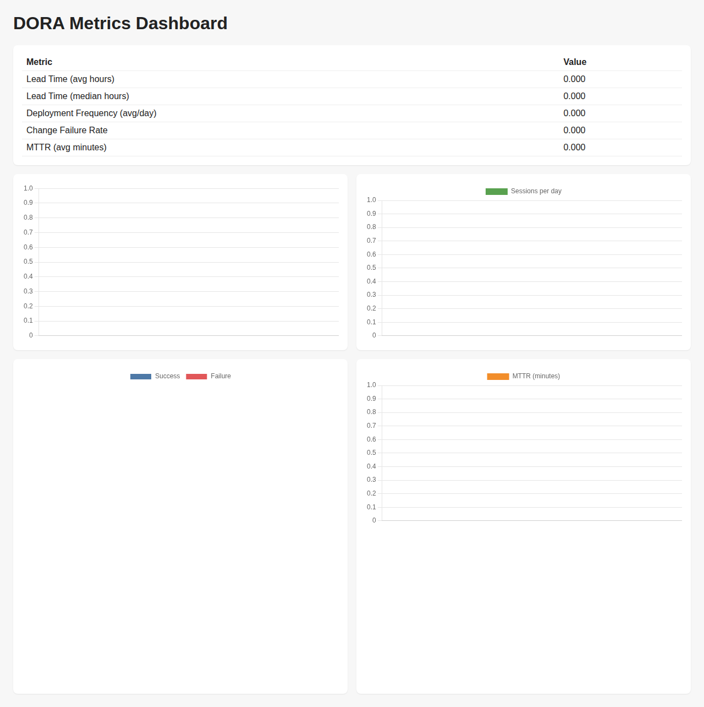

# Isaac VR Project

## Description
VR 사람-로봇 협업 데이터 수집 및 분석 파이프라인 프로젝트입니다. 
NVIDIA Isaac Sim 4.5 기반 환경에서 로봇 팔(Panda)과 VR 트래킹을 통해 실시간으로 제어되는 사용자(손/팔 실린더 프록시) 간의 물체 조작(Pick and Place) 태스크를 시뮬레이션합니다. 
버전 관리 및 로깅된 실험 데이터를 통해 수정된 DORA 4대 지표를 자동 산출하고 대시보드로 구성하는 기능도 포함되어 있습니다.

## Installation
1. [NVIDIA Isaac Sim 4.5](https://developer.nvidia.com/isaac-sim) 이상 버전을 설치합니다.
2. 레포지토리를 Clone 합니다:
   ```bash
   git clone https://github.com/railabchan/isaac_vr_project.git
   cd isaac_vr_project
   ```

## Usage
메인 시뮬레이션 환경은 Isaac Sim의 파이썬 인터프리터를 사용해 실행합니다:
```bash
isaac ~/isaac_vr_project/v2/main.py
```
- VR 트래킹 데이터는 UDP 포트 `5555`를 통해 JSON 형태로 송신해야 로봇 환경 내에서 반영됩니다.

### DORA 지표 대시보드
자동화된 실험 파이프라인 관리를 위해 변경된 DORA 지표를 수집하고 시각화합니다.
- **Lead Time**: 시나리오/코드 변경부터 유효 데이터 추출까지의 시간
- **Deployment Frequency**: 수집 세션 성공 횟수 (일 단위)
- **Change Failure Rate**: 세션 실패 비율 (실패 / 전체)
- **MTTR**: 장애 발생부터 복구 완료까지의 평균 시간

*대시보드 HTML 출력 결과는 GitHub Actions 파이프라인 성공 후 `metrics/out/dashboard.html`에서 확인할 수 있습니다.*

<!-- DORA_SCREENSHOT -->


### 이벤트 로그 스키마
`metrics/session_events.csv`

컬럼: `timestamp,event,details`

이벤트 예시:
- `code_change`
- `session_start`
- `session_success`
- `session_failed`
- `incident_start`
- `incident_end`

## License
이 프로젝트는 [MIT License](LICENSE)에 따라 배포됩니다.
