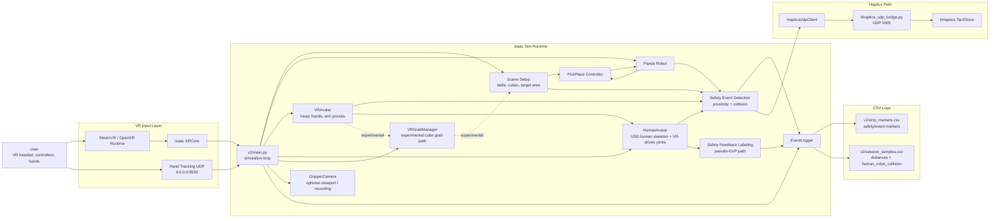
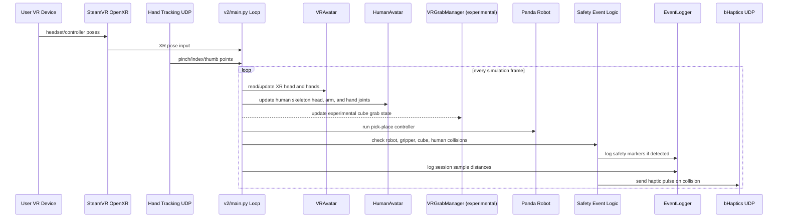

# Isaac VR Pipeline

This document summarizes the runtime equipment and data flow for the Isaac VR
human-robot collaboration project.

## System Flow



## Per-Frame Runtime Sequence



## Notes

- `v2/session_samples.csv` stores per-frame or interval samples such as hand
  distances and `human_robot_collision`.
- `v2/errp_markers.csv` stores event markers such as episode starts, safety
  feedback labels, collisions, and episode ends. The current implementation can
  represent some safety labels as pseudo-ErrP-style feedback, but the platform
  scope is broader HRI safety data collection.
- `docs/rl_trajectory_schema.md` defines the v0 observation/action/reward
  contract for trajectory collection and policy learning.
- `HumanAvatar` references Isaac's `human_skeleton.usd` and drives the head,
  arm, and hand joints from VR HMD/hand poses. It keeps an internal collision
  model for safety feedback labeling and RL observations; visual debug proxies
  are optional.
- `VRGrabManager` is an experimental path from an earlier attempt to let the
  human directly grab/release cubes. It remains in the codebase, but the final
  submitted platform should be described around robot pick-and-place, VR human
  state collection, proximity/collision logging, and safety feedback labeling
  rather than completed human cube grabbing.

## TensorBoard CSV Visualization

The CSV logs can be converted into TensorBoard event files for offline graph
inspection.

```bash
python -m pip install tensorboard tensorboardX
python scripts/csv_to_tensorboard.py
tensorboard --logdir runs/isaac_vr_csv
```

The generated TensorBoard logs include:

- `distance/*`: left, right, and minimum hand-to-gripper distances.
- `collision/human_robot_collision`: sampled robot collision flag.
- `events/*`: impulse markers for each safety/event marker type.
- `events_cumulative/*`: cumulative counts per event type.
