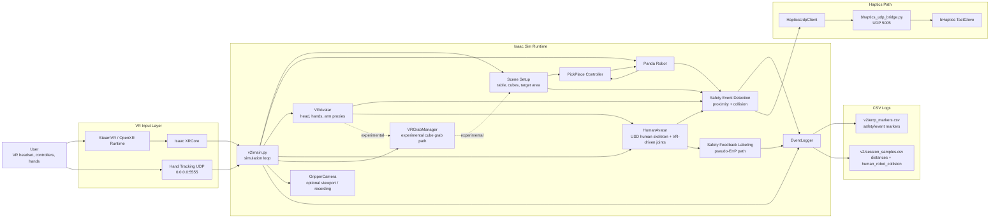
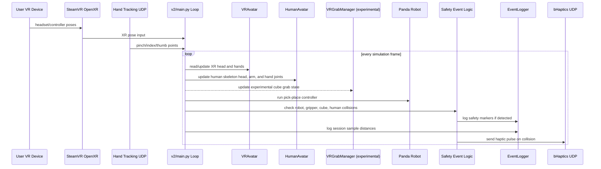

# Isaac VR Pipeline

This document summarizes the runtime equipment and data flow for the Isaac VR
human-robot collaboration project.

## System Flow


```mermaid
flowchart LR
    User["User<br/>VR headset, controllers, hands"]

    subgraph VR["VR Input Layer"]
        SteamVR["SteamVR / OpenXR Runtime"]
        XRCore["Isaac XRCore"]
        HandUDP["Hand Tracking UDP<br/>0.0.0.0:5555"]
    end

    subgraph Isaac["Isaac Sim Runtime"]
        Main["v2/main.py<br/>simulation loop"]
        World["Scene Setup<br/>table, cubes, target area"]
        Panda["Panda Robot"]
        PickPlace["PickPlace Controller"]
        Avatar["VRAvatar<br/>head, hands, arm proxies"]
        Human["HumanAvatar<br/>USD human skeleton + VR-driven joints"]
        Grab["VRGrabManager<br/>experimental cube grab path"]
        GripCam["GripperCamera<br/>optional viewport / recording"]
        Collision["Safety Event Detection<br/>proximity + collision"]
        PseudoErrP["Safety Feedback Labeling<br/>pseudo-ErrP path"]
        Logger["EventLogger"]
    end

    subgraph Haptics["Haptics Path"]
        HClient["HapticsUdpClient"]
        Bridge["bhaptics_udp_bridge.py<br/>UDP 5005"]
        Tact["bHaptics TactGlove"]
    end

    subgraph Logs["CSV Logs"]
        Markers["v2/errp_markers.csv<br/>safety/event markers"]
        Samples["v2/session_samples.csv<br/>distances + human_robot_collision"]
    end

    User --> SteamVR
    User --> HandUDP

    SteamVR --> XRCore
    XRCore --> Main
    HandUDP --> Main

    Main --> World
    Main --> Panda
    Main --> Avatar
    Main --> Human
    Main --> Grab
    Main --> GripCam

    World --> PickPlace
    Panda --> PickPlace
    PickPlace --> Panda

    Avatar --> Collision
    Avatar --> Human
    Human --> Collision
    Human --> PseudoErrP
    Panda --> Collision
    World --> Collision

    Avatar -. experimental .-> Grab
    Grab -. experimental .-> World

    Collision --> Logger
    PseudoErrP --> Logger
    Main --> Logger

    Logger --> Markers
    Logger --> Samples

    Collision --> HClient
    HClient --> Bridge
    Bridge --> Tact
```

## Per-Frame Runtime Sequence


```mermaid
sequenceDiagram
    participant U as User VR Device
    participant XR as SteamVR OpenXR
    participant HT as Hand Tracking UDP
    participant M as v2/main.py Loop
    participant A as VRAvatar
    participant HA as HumanAvatar
    participant G as VRGrabManager (experimental)
    participant R as Panda Robot
    participant C as Safety Event Logic
    participant L as EventLogger
    participant H as bHaptics UDP

    U->>XR: headset/controller poses
    XR->>M: XR pose input
    HT->>M: pinch/index/thumb points

    loop every simulation frame
        M->>A: read/update XR head and hands
        M->>HA: update human skeleton head, arm, and hand joints
        M-->>G: update experimental cube grab state
        M->>R: run pick-place controller
        M->>C: check robot, gripper, cube, human collisions
        C->>L: log safety markers if detected
        M->>L: log session sample distances
        C->>H: send haptic pulse on collision
    end
```

## Notes

- `v2/session_samples.csv` stores per-frame or interval samples such as hand
  distances and `human_robot_collision`.
- `v2/errp_markers.csv` stores event markers such as episode starts, safety
  feedback labels, collisions, and episode ends. The current implementation can
  represent some safety labels as pseudo-ErrP-style feedback, but the platform
  scope is broader HRI safety data collection.
- `docs/rl_trajectory_schema.md` defines the v0 observation/action/reward
  contract for trajectory collection and policy learning.
- `HumanAvatar` references Isaac's `human_skeleton.usd` and drives the head,
  arm, and hand joints from VR HMD/hand poses. It keeps an internal collision
  model for safety feedback labeling and RL observations; visual debug proxies
  are optional.
- `VRGrabManager` is an experimental path from an earlier attempt to let the
  human directly grab/release cubes. It remains in the codebase, but the final
  submitted platform should be described around robot pick-and-place, VR human
  state collection, proximity/collision logging, and safety feedback labeling
  rather than completed human cube grabbing.

## Encounter-Based Safety Learning

The safety policy no longer has to replay every recorded session from frame
zero. The canonical learning unit is a phase-matched encounter:

```text
collection session
  -> recorded episode
  -> cube/attempt boundary
  -> encounter window
  -> one full RL task rollout with one selected encounter
```

An encounter window contains lead-in and recovery margins, but encounters are
never concatenated inside one RL episode. The robot still executes a complete
pick-and-place rollout. Human motion begins when the current task reaches the
recorded controller event/task phase.

### Time-Correct Dynamic Replay

Encounter replay defaults to `--encounter-timebase recorded`. Human poses are
interpolated using `pose_monotonic_time_ns`, so a collected second remains one
second at `--encounter-playback-speed 1.0`. The legacy one-recorded-frame per
simulation-step behavior remains available only as `--encounter-timebase step`
for ablation and debugging.

The collection HDF5 schema remains the established 83-D observation schema.
At runtime, the safety environment recomputes 26 dynamic values against the
current policy trajectory and appends them to form a 109-D safety-policy input:

| Dynamic input | Dimensions |
|---|---:|
| Filtered left/right hand velocity | 6 |
| Closest left/right robot surface-point velocity | 6 |
| Left/right hand-to-surface relative velocity | 6 |
| Left/right closing speed | 2 |
| Left/right TTC | 2 |
| Left/right dynamic-measurement validity | 2 |
| Left/right TTC validity | 2 |
| **Total addition** | **26** |

Robot surface velocity includes the current closest link's translation and
rotation, `v_surface = v_origin + omega x (p_surface - p_origin)`. Closing speed
and TTC are derived from the current surface-gap trajectory. Recorded collision,
near, robot velocity, and TTC values are never used as current-policy labels.

New PPO, SAC, and TD3 safety checkpoints use
`hri_policy_obs_v2_109d_surface_gap_dynamics`. Existing 83-D checkpoints remain
loadable for backward-compatible evaluation, but they cannot use dynamic input
and must not be treated as the dynamic-policy result.

The mutually exclusive target categories are:

| Category | Recorded surface gap |
|---|---:|
| `safe` | greater than 15 cm for a stable window |
| `gate_only` | 5-13 cm |
| `near` | 2-5 cm |
| `near_miss` | 0-2 cm |
| `collision` | gap at or below 0 cm, or active contact |

These labels are used only to build and sample the encounter manifest. During
training and evaluation, surface gap, gate activation, near flags, and
collision are recomputed from the current robot pose and PhysX collision
geometry. Evaluation therefore records both `encounter_target_severity` and
`encounter_realized_severity`.

### Data Split

Split by collection session before building encounter manifests. Never split
windows from one session across train and evaluation sets.

```bash
python v3_chan/build_encounter_manifest.py \
  v3_chan/trajectories/hri_v4_session_01.hdf5 \
  v3_chan/trajectories/hri_v4_session_02.hdf5 \
  v3_chan/trajectories/hri_v4_session_03.hdf5 \
  --output v3_chan/trajectories/manifests/train_sessions_01_03.json

python v3_chan/build_encounter_manifest.py \
  v3_chan/trajectories/hri_v4_session_04.hdf5 \
  --output v3_chan/trajectories/manifests/eval_session_04.json
```

The default segmentation uses a 13 cm gate onset sustained for three frames,
15 clear frames above 15 cm to close an encounter, and 30-frame margins.

### PPO, SAC, and TD3 Screen

PPO, SAC, and TD3 are initial candidates, not three proposed methods. They are
screened using the same frozen task policy, train/evaluation manifests,
environment-step budget, gate thresholds, residual scale, and evaluation
seeds. The best stable method is retained for the main study; the others can
remain implementation baselines.

```bash
python v3_chan/run_encounter_benchmark.py \
  --train-manifest v3_chan/trajectories/manifests/train_sessions_01_03.json \
  --eval-manifest v3_chan/trajectories/manifests/eval_session_04.json \
  --algorithms ppo,sac,td3 \
  --total-steps 30000 \
  --encounter-timebase recorded \
  --encounter-playback-speed 1.0 \
  --eval-seeds 11,1011,2011 \
  --device cuda \
  --experiment-tag hri_v4_screen_v1
```

The training and evaluation scripts use recorded-time replay by default. An
explicit single-policy PPO run can record the choice in its checkpoint as:

```bash
ISAAC_SKIP_VR_WAIT=1 ./launch_isaac.sh \
  "$PWD/v3_chan/train_safety_residual.py" \
  --task-checkpoint v3_chan/policies/ppo_pick_place_v7_residual_rewardv4_strict_best.pt \
  --encounter-manifest v3_chan/trajectories/manifests/train_sessions_01_03.json \
  --encounter-timebase recorded \
  --encounter-playback-speed 1.0 \
  --output v3_chan/policies/ppo_safety_dynamic_encounter_v1.pt \
  --total-steps 30000 \
  --xyz-only-residual \
  --no-pseudo-errp \
  --device cuda
```

The runner creates:

```text
v3_chan/policies/encounter_benchmarks/hri_v4_screen_v1/
v3_chan/eval_results/encounter_benchmarks/hri_v4_screen_v1/
```

`summary.json` groups task-only, PPO, SAC, and TD3 results by target severity.
Step CSV files retain gate state, current surface gap, residual magnitude,
applied position offset, and robot/hand positions for later avoidance-direction
analysis.

For a deterministic held-out replay without retraining, set `--episodes 0`.
This evaluates every scenario in the manifest once:

```bash
ISAAC_SKIP_VR_WAIT=1 ./launch_isaac.sh \
  "$PWD/v3_chan/evaluate_rollout_policy.py" \
  --checkpoint v3_chan/policies/ppo_pick_place_v7_residual_rewardv4_strict_best.pt \
  --safety-residual-checkpoint v3_chan/policies/encounter_benchmarks/hri_v4_screen_v1/ppo_safety_best.pt \
  --encounter-manifest v3_chan/trajectories/manifests/eval_session_04.json \
  --encounter-policy cycle \
  --episodes 0 \
  --mask-human-obs-for-policy \
  --no-pseudo-errp \
  --device cuda
```

After the replay screen, the selected safety policy must still be evaluated
with live VR motion. Replay is the repeatable intermediate benchmark; live VR
tests whether the policy reacts to a human who changes motion in response to
the robot.

## TensorBoard CSV Visualization

The CSV logs can be converted into TensorBoard event files for offline graph
inspection.

```bash
python -m pip install tensorboard tensorboardX
python scripts/csv_to_tensorboard.py
tensorboard --logdir runs/isaac_vr_csv
```

The generated TensorBoard logs include:

- `distance/*`: left, right, and minimum hand-to-gripper distances.
- `collision/human_robot_collision`: sampled robot collision flag.
- `events/*`: impulse markers for each safety/event marker type.
- `events_cumulative/*`: cumulative counts per event type.

## Source-Aligned Realized-Risk Mining

Realized-risk screening must reproduce each encounter under its source task
configuration. The previous screen randomized the scene with the evaluation
seed and selected the active cube from `episode_index % 3`. Consequently, a
human encounter recorded around one cube could be combined with the task-only
trajectory for another cube. In the old Fold 1 train screen, only 131 of 400
screening episodes used the source active-cube index; 269 (67.25%) were
mismatched. Therefore, the previous 234/400 retained result is a conditional
replay rate under reassigned task configurations, not an intrinsic encounter
validity rate.

The restoration order is now:

1. `exact_pose`: restore all source cube poses, the place-target pose, source
   active-cube identity, and the recorded initial robot joint state.
2. `collection_seed`: use the collection/layout seed only when exact poses are
   unavailable.
3. `legacy_fallback`: random screening configuration, available only through
   the explicit compatibility flag and unsuitable for formal results.
4. `unavailable`: skip the scenario and report
   `source_configuration_unavailable` rather than misclassifying it as
   `insufficient_gate_steps`.

The current 14-session P01 v8 dataset supports `exact_pose` restoration for
all 42 source episodes. Legacy manifests are enriched lazily from their source
HDF5 files, while newly built manifests embed the restoration provenance
directly.

The task rollout still starts from the restored episode initial state. Human
encounter playback remains inactive until the frozen task policy reaches the
recorded controller event/task phase, then translates the recorded human path
by the difference between the source and runtime end-effector anchors. This
preserves the encounter's task timing and EE-relative alignment without
teleporting the task policy into a recorded mid-trajectory robot state.

Task-only policy remains part of mining. The screen measures baseline risk
under `source configuration + frozen task-only policy + source human
encounter`; it does not attempt to reproduce the robot motion recorded during
collection. A separate `source-trajectory validation` mode may replay the
recorded robot trajectory to answer whether the original collection itself
contained the recorded risk, but that is a different validation question.

Run the corrected Fold 1 screen and filter with:

```bash
ISAAC_SKIP_VR_WAIT=1 ./launch_isaac.sh \
  "$PWD/v3_chan/evaluate_rollout_policy.py" \
  --checkpoint v3_chan/policies/ppo_pick_place_v7_residual_rewardv4_strict_best.pt \
  --encounter-manifest v3_chan/trajectories/manifests/p01_v8_cv4/fold_01_train.json \
  --encounter-policy cycle --episodes 0 --seed 11 --device cuda \
  --mask-human-obs-for-policy --no-pseudo-errp \
  --output-json v3_chan/eval_results/encounter_benchmarks/p01_v8_source_aligned_v3/mining/task_only_train_all.json \
  --output-csv v3_chan/eval_results/encounter_benchmarks/p01_v8_source_aligned_v3/mining/task_only_train_all.csv \
  --output-step-csv v3_chan/eval_results/encounter_benchmarks/p01_v8_source_aligned_v3/mining/task_only_train_all_steps.csv

python v3_chan/filter_encounter_manifest.py \
  --manifest v3_chan/trajectories/manifests/p01_v8_cv4/fold_01_train.json \
  --screen-results v3_chan/eval_results/encounter_benchmarks/p01_v8_source_aligned_v3/mining/task_only_train_all.json \
  --output v3_chan/trajectories/manifests/p01_v8_cv4/fold_01_train_realized_risk_gate10_source_aligned.json \
  --report v3_chan/eval_results/encounter_benchmarks/p01_v8_source_aligned_v3/mining/realized_risk_filter_report.json \
  --min-gate-active-steps 10 --min-geometry-valid-steps 1 \
  --previous-retained-count 234 --previous-input-count 400
```

Policies trained from the old 234-scenario subset and their evaluations are
provisional. They must be retrained and reevaluated with the corrected
source-aligned subset before use as formal experimental results.

### Corrected Fold 1 Result

The corrected task-only screen restored all 400 encounters with `exact_pose`:

- source/screening cube mismatches: 0/400
- source/screening layout mismatches: 0/400
- cube, target, or robot restoration failures: 0/400
- maximum recorded cube/target pose error: 0
- task success: 400/400
- overall gate-active step rate: 18.72%
- overall collision step rate: 3.91%
- retained by the unchanged gate-10 filter: 240/400 (60.0%)
- rejection: 160 `insufficient_gate_steps`; no provenance rejection

The retained realized-severity distribution is 62 gate-only, 40 near, 17
near-miss, and 121 collision encounters. Although the aggregate retained count
changed only from 234 to 240, 61 individual encounter decisions changed: 28
old gate rejections became retained, 26 old retained encounters became gate
rejections, and all seven old task failures changed classification. This is
why the previous subset cannot be retained on the basis of its similar total
size.

A six-encounter exact-restoration check produced identical success, step,
reward, gate-step, and collision-step values with screening seeds 11 and
24001. Once exact source poses are restored, the screening seed no longer
reassigns the task layout.
